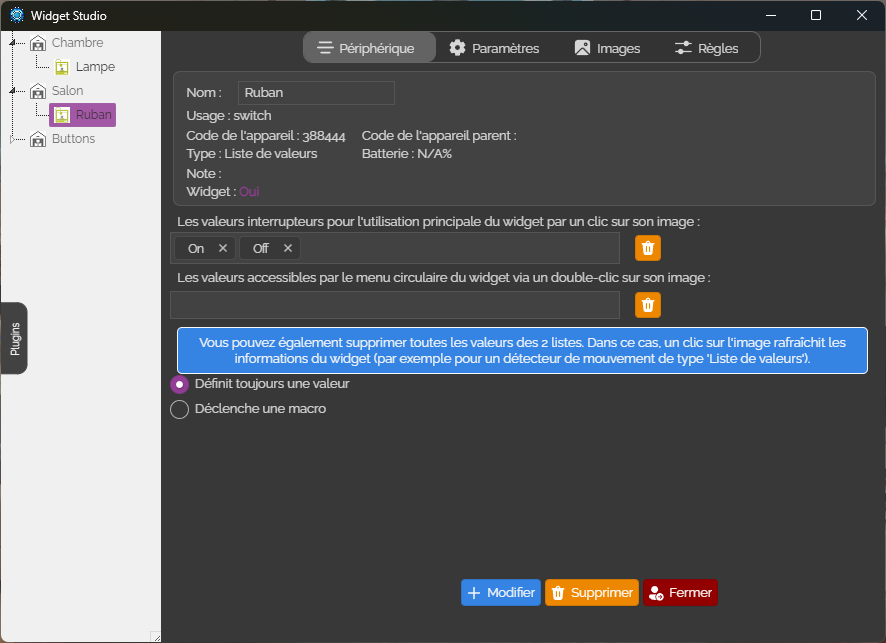

# 🔌 Plugin Tasmota pour A.V.A.T.A.R


This plugin allows you to interface **Tasmota** devices with the **A.V.A.T.A.R** platform.

---

## 🧠 Fonctionnement

The Tasmota Widget Plugin allows you to easily control and display your Tasmota devices in [A.V.A.T.A.R](https://github.com/Avatar-Home-Automation) framework.  
It will allow you to have widgets to control your devices.

- Scan the network to find your Sonoff modules.
- Automatic configuration of the prop file according to your modules
- Access the list of your modules in `Widget Studio` and the `Tasmota` plugin.
  
##### 🗣️ Support multilingue

---

## 🖼️ Paramètres

<p align="center"></p>

---

## 🧩 Widgets Studio

<table style="width: 100%; table-layout: fixed;">
  <tr>
   <td style="text-align: center;">
     <br>
    </td>
    <td style="text-align: center;">
      <br>
    </td>
  </tr>
</table>

---

## 🛠️ Installation

```bash
Search the plugin `tasmota` in the A.V.A.T.A.R plugin library and click `install`.
```


