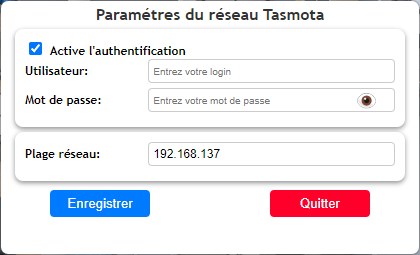

# Tasmota

  
  
Displays Sonoff modules (connected devices)

## Configuration

### After installing the plugin and launching the Avatar server 

1. A configuration window will open
   

  

   

  

2. Fill in the fields (the IP range is mandatory so that the plugin can search for your connected devices on your network).
3. If your Sonoff modules require a login and password, fill in those details in the authentication section as well.
4. The plugin will then scan for modules present on your network, and you will find them in Widget Studio.

  

  

   
