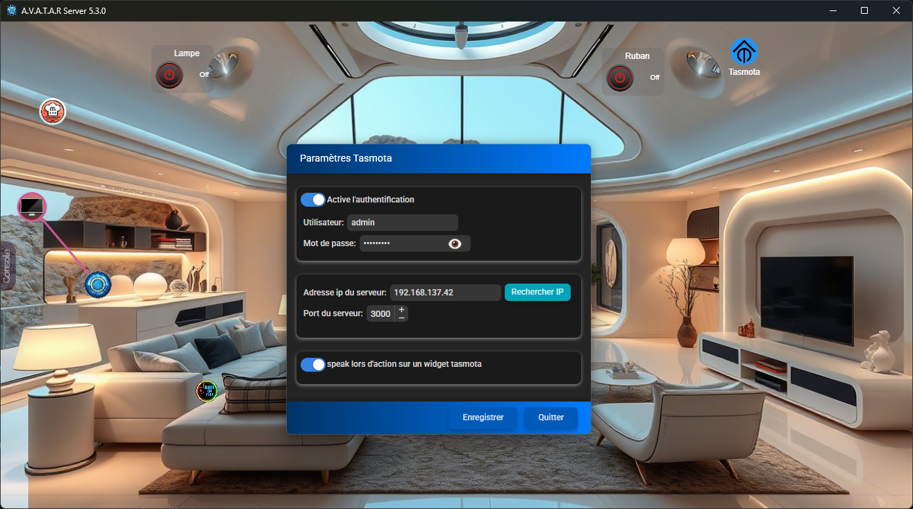
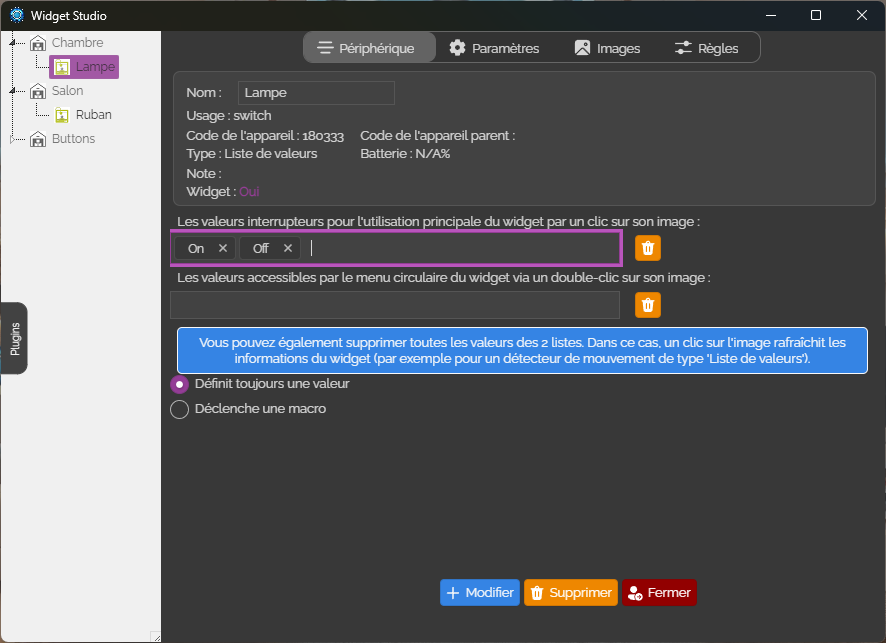
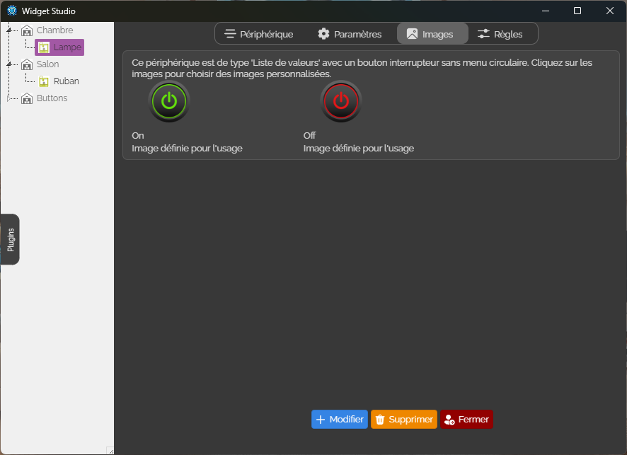
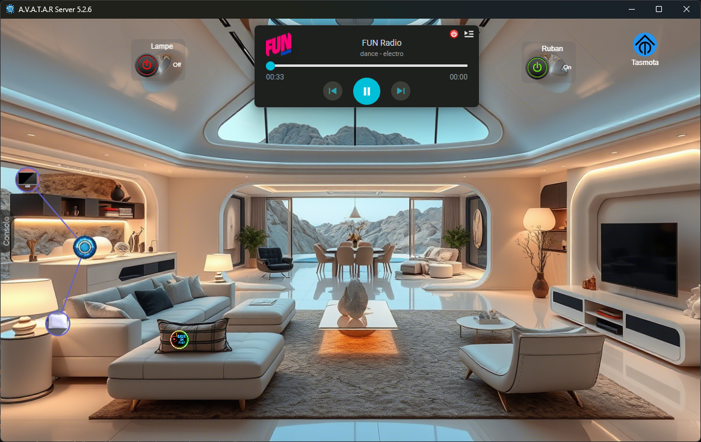
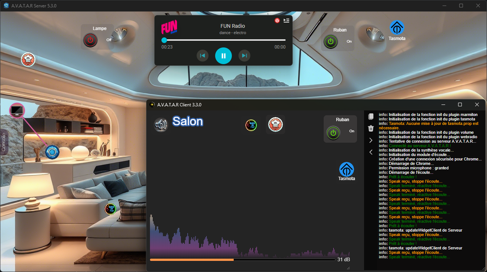

# 🔌 Plugin Tasmota pour A.V.A.T.A.R


Ce plugin permet d'interfacer les périphériques **Tasmota** avec la plateforme **A.V.A.T.A.R**.

---

## 🧠 Fonctionnement

Le plugin **Tasmota Widget** vous permet de contrôler et d'afficher facilement vos appareils Tasmota dans le framework [A.V.A.T.A.R](https://github.com/Avatar-Home-Automation).

### Il permet notamment :

- 🔍 Scanner le réseau pour détecter vos modules **Sonoff**.
- ⚙️ Configurer automatiquement le fichier `.prop` selon vos modules détectés.
- 📋 Afficher la liste de vos modules dans le `Widget Studio`, via le plugin **Tasmota**.

> 🗣️ *Support multilingue intégré*

---

## 🖼️ Paramètres

<p align="center">
  
</p>

---

## 🧩 Widget Studio

<p align="center">
  
  &nbsp;&nbsp;
  
</p>

---

## 💻 Interface

<p align="center">
  
</p>
<p align="center">
  
</p>

---

## ✨ Nouvelles Fonctionnalités

- Ajout la possibilité de faire parler Avatar lors d'une action sur un widget tasmota.
- Réglage du port serveur pour les updates widgets.
- Ajout de l'icone settings sur les clients.
- Lors de la modification des paramètres, demande a redémarrer.


## 🛠️ Installation

```bash
Recherchez le plugin `tasmota` dans la bibliothèque de plugins A.V.A.T.A.R, puis cliquez sur `install`.
