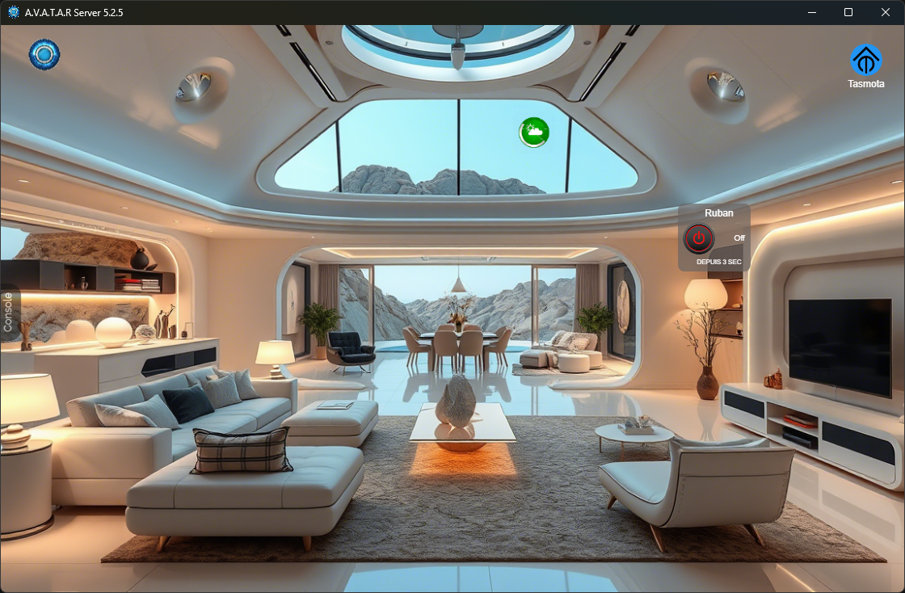
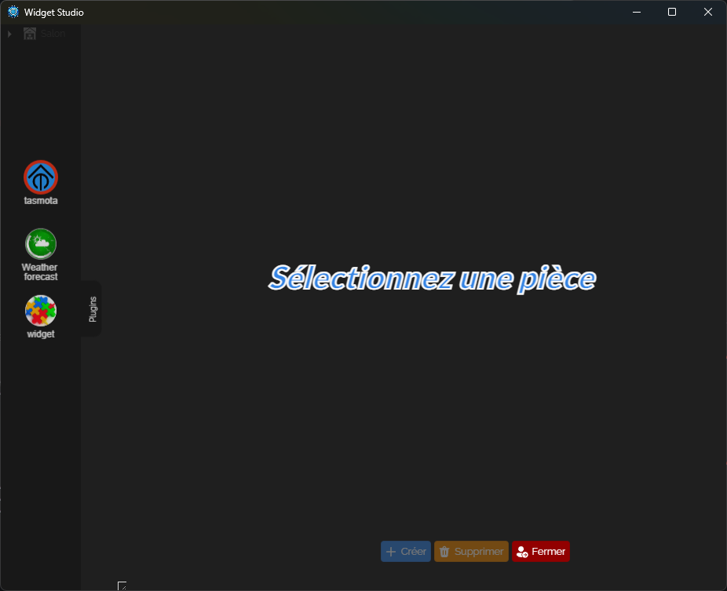
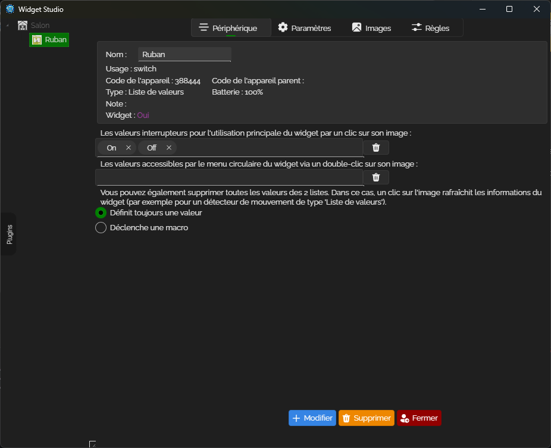

# Plugin tasmota


<p align="center"></p>
<p align="center"></p>

### ✨ Feature
The Tasmota plugin is a widget manager for your Sonoff connected modules within the [A.V.A.T.A.R](https://github.com/Avatar-Home-Automation) framework.  
It will allow you to have widgets to control your devices.

- Scan the network to find your Sonoff modules.
- Access the list of your modules in `Widget Studio` and the `Tasmota` plugin.

<table style="width: 100%; table-layout: fixed;" cellspacing="0">
  <tr>
   <td style="text-align: center;">
     <br>
    </td>
    <td style="text-align: center;">
      <br>
    </td>
  </tr>
</table>

### ✨ New Feature
- Added a button widget to access the plugin configuration.

## Installation

Tasmota works on [Avatar Server](https://github.com/Avatar-Home-Automation) v5.0.0+.

Installation:

```sh
1. Search the plugin `tasmota` in the A.V.A.T.A.R plugin library and click `install`.
```
